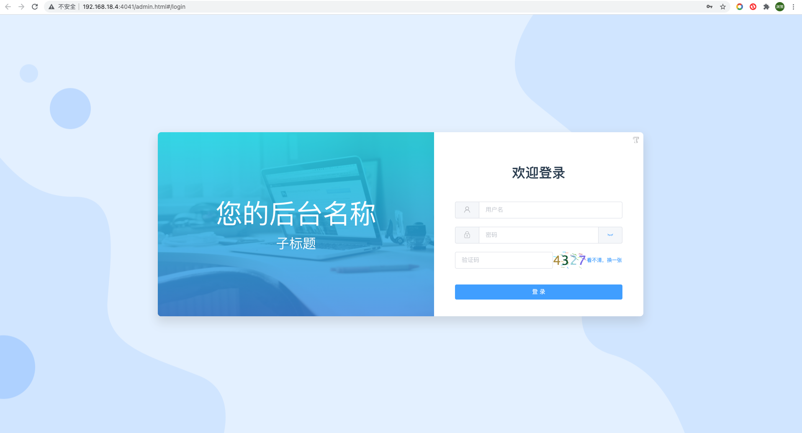
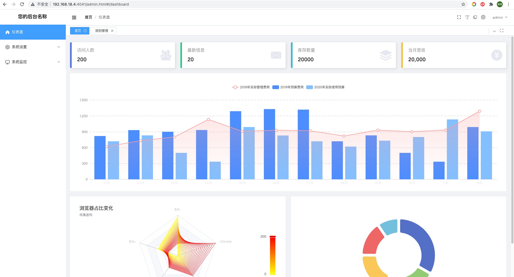
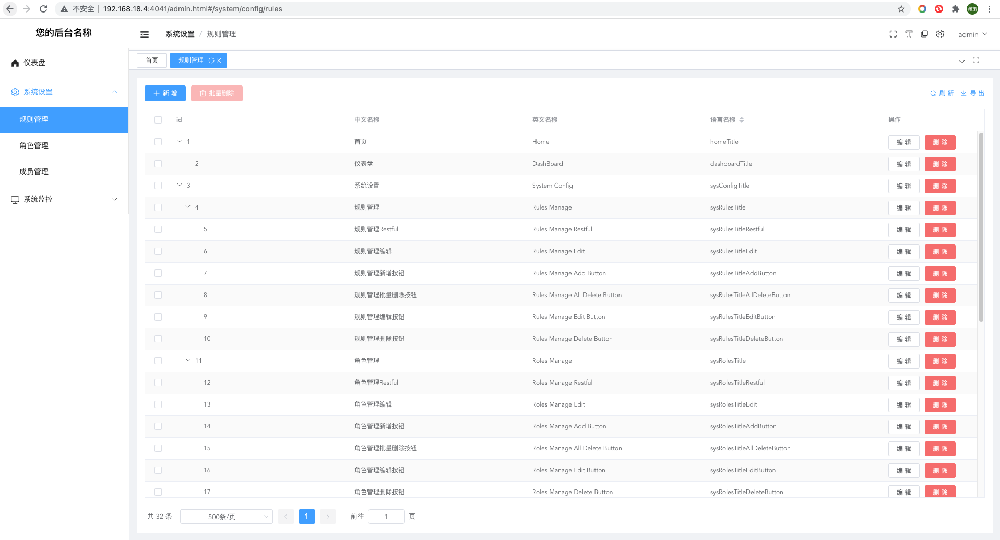
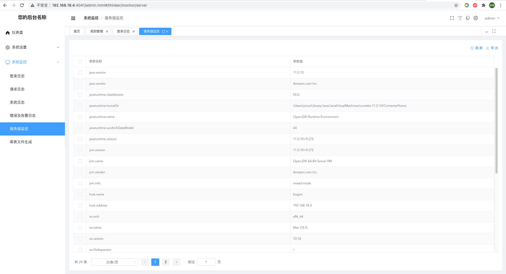

> Thinker-Admin-Box 是一个基于Spring Boot 2.6.0 & Mybatis-plus 3.4.3 构建的自建TOKEN的权限管理系统。


- 部署环境: [GITHUB](https://github.com/yirius/thinker-admin-box-web) | [GITEE](https://gitee.com/yirius/thinker-admin-box-web)
- 模块开发环境: [GITHUB](https://github.com/yirius/thinker-admin-box) | [GITEE](https://gitee.com/yirius/thinker-admin-box)

- 文档请点击[DOCUMENT](https://yirius.github.io/thinker-admin-box/index.html#/)
- 国内文档[DOCUMENT](https://www.thinkeradmin.com/index.html#/)
- Thinker-Admin-Box是一个简单高效的后台权限管理系统。
- JAVA框架采用 Spring Boot 2.6.0，引入大量新型机制。
- 数据库交互采用Mybatis/Mybatis-Plus，参考THINKPHP引入了自定义DATABASE组件，可进行快捷连表字段查询。
- 参考SA-TOKEN自定义TOKEN权限，可实现对按钮级别的权限控制。
- 界面使用[VUE-ADMIN-BOX](https://github.com/cmdparkour/vue-admin-box)构建，并提供多套配色以供选择。

## 演示地址
http://demo.thinkeradmin.com/admin.html | http://tkadmin.tjxinhefu.com/admin.html

演示环境账号密码:

账号 | 密码| 权限
---|---|---
admin | 123456 | 超级管理员

> 测试环境sql一个小时重置一次

## 最简代码创建VUE列表+表单界面示例
```java
public class SystemController extends ThinkerController{

    @RequestMapping(value = "/members.vue")
    public String members()  {
        return ThinkerAdmin.table(thinkerTable -> {
            thinkerTable.setApi("/restful/thinker/system/members")
                    .setEditUrl("/thinker/system/membersEdit.vue");

            thinkerTable.column("id", "id");
            thinkerTable.column("username", "账户名");
            thinkerTable.column("op", "操作").edit().delete().setWidth("180px");

            thinkerTable.toolbar().add().delete().defaultTools();
        }).page().toString();
    }
    
    @RequestMapping(value = "/membersEdit.vue")
    public String membersEdit() {
        return ThinkerAdmin.form(thinkerForm -> {
            thinkerForm.input("username", "账户名");
            thinkerForm.input("password", "密码").setType(Input.InputType.PASSWORD);
            thinkerForm.input("remarks", "备注").setType(Input.InputType.TEXTAREA);

            thinkerForm.select("groupIds", "对应角色组").setOptions(
                    SpringContext.getBean(TkGroupsImpl.class).query().eq("status", 1).list()
                            .stream().map(tkGroups -> LabelValue.create(tkGroups.getTitle(), tkGroups.getId()))
                            .collect(Collectors.toList())
            ).setMultiple(true).createDisabled();

            thinkerForm.switchs("status", "角色状态").createDisabled();
        }).setSubmitUrl("/restful/thinker/system/members").page().toString();
    }
}
```

## 功能模块
```bash
|-------------------------------------------|  
|  _____  _      _         _                |  
| /__   \| |__  (_) _ __  | | __ ___  _ __  |  
|   / /\/| '_ \ | || '_ \ | |/ // _ \| '__| |  
|  / /   | | | || || | | ||   <|  __/| |    |  
|  \/    |_| |_||_||_| |_||_|\_\\___||_|    |  
|             @Author: Yirius               |  
|           @QQ Group: 735838842            |  
|-------------------------------------------|
|--系统设置
|   |--规则管理
|   |--角色管理
|   |--成员管理
|--系统监控
|   |--登录日志
|   |--请求日志
|   |--系统日志
|   |--错误及告警日志
|   |--服务器监控
|   |--库表文件生成
```

# 技术选型
## 后端
- 后端
    - SpringBoot 2.6.0
    - 数据库链接: Mybatis-Plus 3.4.3
    - 数据库连接池: hikari
    - 数据缓存: Redis
    - 延迟通知队列: RabbitMq(若引用thinker-admin-queue)
    - 其他: HuTool All/FastJSON/lombok等

## 前端
- 前端([vue-admin-box](https://github.com/cmdparkour/vue-admin-box))
    - MVVM框架: vue3
    - 工程化管理: vite2
    - UI框架: element-plus
    - 路由管理: vue-router4
    - 状态管理: vuex4
    - 数据请求: axios
    - 实用工具库: @vueuse/core

## 开发环境
- 开发环境
    - JDK最低版本：1.8(JAVA 8)
    - 依赖管理：maven&pom
    - 数据库版本：mysql 5.5+

##系统截图




