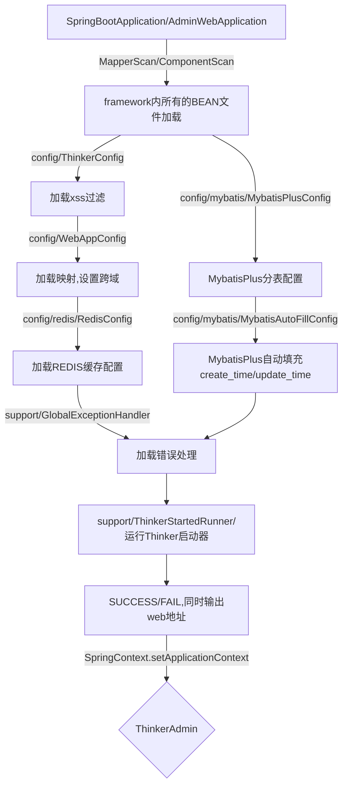

> framework运行机理

# framework下文件夹对应内容

- admin(放置后台界面相关)
    - controller(登录API/规则+监控界面)
    - entity(实体类)
    - login(存放登录的规则判断)
    - mapper
    - restful(存在controller对应的restful路由+逻辑)
    - service
    - serviceimpl

- framework(放置框架核心逻辑)
    - `ThinkerAdmin.java` 对内部可用方法进行了封装
    - abstracts(所有的继承类)
      - `LoginAbstract`(如果需要自己撰写登录判断逻辑，需要impl这个)
      - `SignAbstract`(如果需要自己撰写@ThinkerSignAspect对应逻辑，需要impl这个)
    - aspect(切面相关类)
      - logs(日志切面)
        - `@ThinkerLogAspect(value= "")` 调用log.warn输出日志
        - `@ThinkerRedisLogAspect(value= "")` 调用Redis存储日志->[后台请求日志内查看]
        - `@ThinkerTableLogAspect(value= "")` 调用tkadmin_logs存储日志->[后台登录/系统日志内查看]
      - sign(签名校验切面)
        - `@ThinkerSignAspect(signIndex = 0)` 调用那一组签名进行校验
    - config(固定配置相关)
    - database(数据库增强相关)
      - entity
        - `ThinkerEntity`(所有entity的基类ThinkerEntity)
      - mybatis
        - `ThinkerMapper`(自己写的其他mapper需要继承)
        - `ThinkerIService`(自己写的其他服务需要继承)
        - `ThinkerServiceImpl`(自己写的其他服务实现需要继承)
      - relation
        - `HasOneEntity` entity参数之一，可以直接引入其他表一条内容
        - `HasManyEntity` entity参数之一，可以直接引入其他表多条内容
      - services
        - pagelist `xxxTableImpl.pageList()`相关基础
      - sharding
        - `ShardingTypes` 如果希望自己实现分表逻辑，应引用
      - utils
        - `ShardingUtil.setSharding(Entity.class, String shardStr)` 可以定义读取分表的后缀
      - wrapper(restful中便捷引入的查询参数)
    - entity(一些有用的实体类)
      - bo
        - `LoginResult` 自己重写Login逻辑时需要引入
      - vo
        - `LabelValue` 部分options需要
        - `TextValue` 部分options需要
        - `WrapperValue` restful中getUseWhere().add(WrapperValue)
    - factory
      - `LoginFactory.loadLogin()` 即可便捷加载当前用户对应的登录账号密码判断逻辑
    - langs(语言包)
    - properties(thinker.yml的加载参数)
      - `ThinkerProperties` 可便捷读取配置参数
    - **renders(渲染类，本框架核心，请参考Table/Form/Page)**
    - service
      - `RedisService` redis操作类
      - `ThreadService` 单次进程内的存储类，伴随进程销毁，防止内存溢出
      - `UploadService` 上传文件的操作类
    - support(基础支持类)
      - `throw new ThinkerException(String message,int code)` 可便捷抛出JSON异常
      - `SpringContext.getBean` 可直接获取SpringBoot管理的BEAN
    - utils(工具类)
      - `CacheUtil` 一些admin相关的缓存类
      - `GenerateSqlUtil` 读取sql并生成文件
      - `ToolsUtil` rand/setTimeout/strToList等常用方法
    - widgets(常用操作类)
      - `ThinkerEncrypt` 封装了Hutool中的常用加密解密校验等操作
      - `ThinkerFile` 可以便捷的操作文件，创建目录等 `ThinkerAdmin.file().getDirPath(String path)`
      - `ThinkerRequest` 便捷获取请求参数
      - `return new ThinkerResponse().data(Dict.create().set("name", "a)).success()` 即可返回JSON 

- token(鉴权相关)
    - abstracts(所有的继承类)
        - `TokenAbstract`(如果需要自己撰写与JWT类似的逻辑，需要impl这个)
    - aspect(切面相关类)
        - logs(日志切面)
            - `@CheckLoginAspect()` 检查是否登录
            - `@CheckRoleAspect(int[] roles, boolean isAnd)` 检查是否登录并存在指定角色
            - `@CheckRuleAspect(name= "")` 检查是否登录并存在指定规则(rules中的[组件地址])
  - abstracts(所有的继承类)
      - `NotLoginException`(未登录抛出的异常)
  - extend(**controller和restful需要继承的**)
      - `ThinkerController`(**继承后会自动判断是否登录且存在权限**)
      - `ThinkerRestful`(**继承后会自动加入restful相关操作**)
  - factory
     - `TokenFactory.loadToken()` 即可便捷加载当前判断用户Access-Token的内容
    