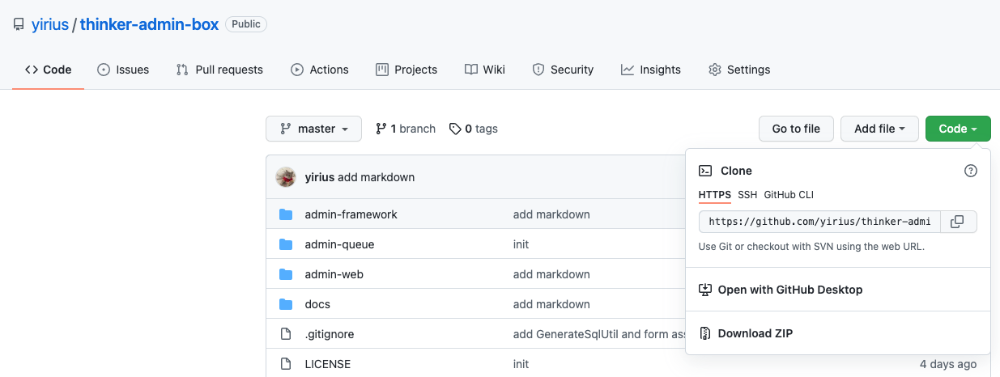
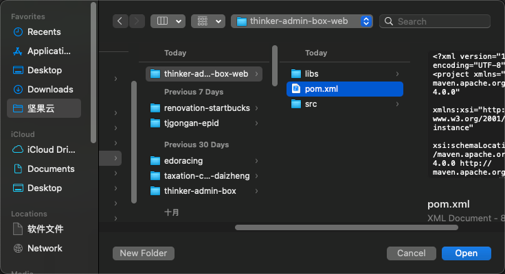
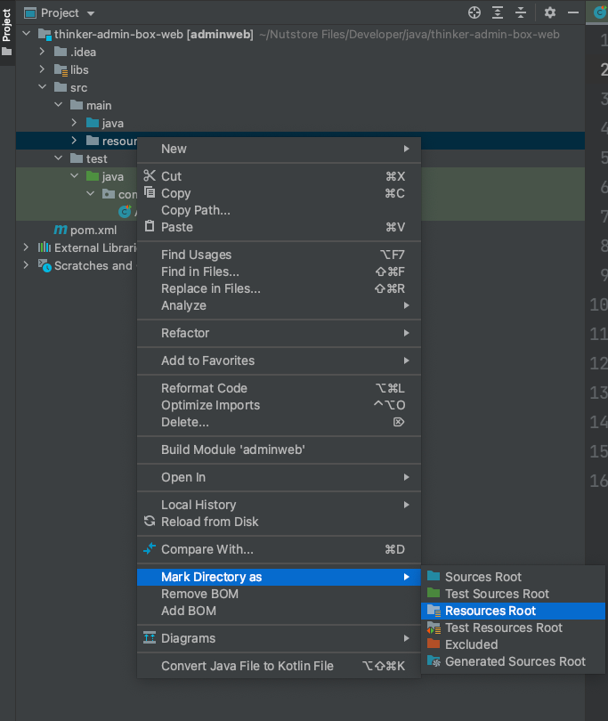
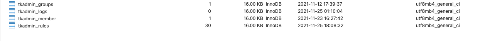

## 项目下载

### 手动下载

访问[thinker-admin-box-web](https://github.com/yirius/thinker-admin-box-web)后点击绿色[Code], 点击[Download Zip]即可



### 命令行下载

```bash
git clone https://github.com/yirius/thinker-admin-box-web.git
```

## 项目导入

> 本示例以IDEA为例，后续均以此为准。Eclipse请依据maven导入

File->open->Selected thinker-admin-box-web



等待Maven下载完成即可

完成后，需要如下图所示，确认src/main的resources是否设置为资源目录，同时libs是否为资源目录也需检查



## 创建数据库

> 数据库sql文件在thinker-admin-box的[adminbox.sql](https://github.com/yirius/thinker-admin-box/blob/master/adminbox.sql)
> 
> 导入任意mysql库后，可以直接修改application-dev.yml等进行设置



- tkadmin_groups  |  角色列表  
- tkadmin_logs    |  数据库类型日志记录表  
- tkadmin_member  |  后台用户成员表  
- tkadmin_rules   |  后台可使用规则表  

然后点击idea->右上角run开启项目，账号密码admin/123456即可访问后台
