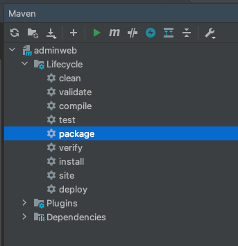

## IDEA打包

在IDEA中，直接点击右侧的MAVEN标签，展开如下图，点击package即可



> 需注意AdminWebApplicationTests.java中是否有测试内容，有的话需检查会不会导致测试无法通过
> 
> 打包完成后的文件在target/admin-web-0.0.1-SNAPSHOT.jar
> 
> 文件改名后即可使用


## 服务器部署

### 提取application-xx.yml

通常情况下，为了方便多台服务器部署的内容一致等情况
- mysql的链接ip需更改
- spring-cloud注册中心ip不定
- 一台服务器一个秘钥

最好把application-dev.yml复制一份，改名为application-xxxx.yml，xxxx为自定义名称

如application-**mypro**.yml，并修正内部的参数，一般为
1. 修改mysql的数据库名称/账号/密码
2. `p6spy: false`，关闭日志输出
3. `redis.database`，修改redis的连接db，并且根据实际情况考虑是否存在password
4. 如果需要使用rabbitmq，判断是否修改username和password

### 建立start.sh或start.bat

start.sh(Linux或mac用)
```shell
BUILD_ID=dontKillMe nohup java -jar 自定义jar名.jar  --spring.profiles.active=mypro >output 2>&1  &
```

start.bat(Windows用)
```shell
chcp 65001
java -Dfile.encoding=utf-8 -jar 自定义jar名.jar  --spring.profiles.active=mypro >output 2>&1  &
```

stop.sh(关闭该jar，只linux或mac需要，windows直接关闭cmd窗口即可)
```shell
#!/bin/bash
PID=$(ps -ef | grep 自定义jar名.jar | grep -v grep | awk '{ print $2 }')
if [ -z "$PID" ]
then
    echo 服务已关闭
else
    echo 关闭服务中 $PID
    kill $PID
fi
```